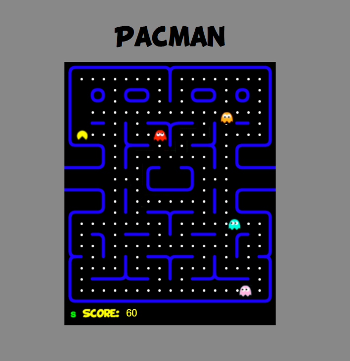

# Pacman JS Game

A simple browser-based Pacman game built with **HTML**, **CSS**, and **JavaScript**.

This is one of my older web development practice projects. I uploaded it to GitHub to organize my previous work and improve it step by step.

## 🎮 Demo



The game runs directly in the browser by opening the `index.html` file.

## ✨ Features

- Pacman movement using Arrow Keys
- WASD movement support
- Game start and restart with the `N` key
- Ghost movement
- Score system
- Collision detection
- Game over screen
- Win condition after collecting all dots
- Built with JavaScript and HTML Canvas

## 🕹️ How to Play

1. Open `index.html` in your browser.
2. Press `N` to start the game.
3. Use the Arrow Keys or WASD keys to move Pacman.
4. Collect all dots to win.
5. Avoid the ghosts.

## 🛠️ Technologies Used

- HTML
- CSS
- JavaScript
- Canvas API

## 📁 Project Structure

```text
pacman-js-game/
│
├── index.html
├── css/
│   └── style.css
├── js/
│   └── pacman.js
├── view/
│   └── game images
├── font/
│   └── custom font
└── assets/
    └── demo.png
```

## ✅ What I Improved

- Separated CSS from HTML
- Improved layout and centered the game board
- Cleaned variable and class names
- Refactored repeated ghost movement logic
- Added WASD controls
- Added win condition
- Prevented dots from respawning after being collected
- Slowed down ghost movement slightly
- Improved game over and restart messages

## 📝 Notes

This is an old practice project that I am gradually improving.  
The current version keeps the original idea of the game while improving the structure, readability, and user experience.

## 🚀 Future Improvements

- Improve ghost movement logic
- Add sound effects
- Add different difficulty levels
- Add a start menu
- Make the layout more responsive